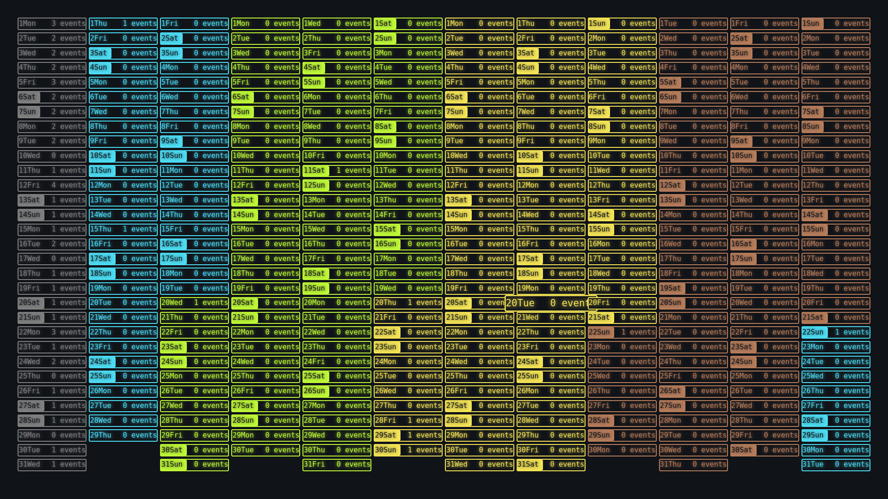

# Interactive Calendar

An interactive calendar created to be used with [the Lively Wallpaper app](https://github.com/rocksdanister/lively).

## Installation
1. Download the last release and unzip the folder
2. Go to the Lively Wallpaper app
3. Click on the '+' button to add a new wallpaper
4. Go to the unzipped folder and select `index.html` file
5. Customize the parameter as you wish

There you have it, the wallpaper is set. There are some other things you can do to improve you experience with the calendar. They are all listed in the [Advanced Settings](#Advance_Settings) section

## Known issues and possible improvements
- [ ] Light mode
- [ ] Python script saving the changes made in the calendar dynamicaly

## Advance Settings
Documentation in progres...
